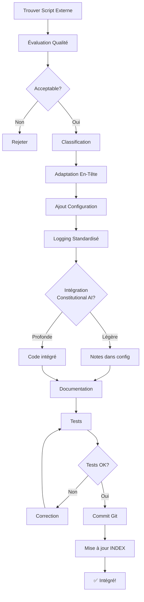

# 🔧 Guide d'Intégration de Scripts jArchi Externes

## 📖 Introduction

Ce guide vous permet d'intégrer des scripts jArchi trouvés ailleurs (GitHub, forums, etc.) dans votre framework de manière cohérente et maintenable.

---

## 🎯 Processus d'Intégration en 5 Étapes

### **Étape 1 : Évaluation du Script** (10 min)

#### **Checklist Qualité**

```
□ Le script s'exécute sans erreur dans Archi ?
□ La documentation est claire (objectif, usage) ?
□ Le code est lisible et commenté ?
□ Pas de dépendances externes non disponibles ?
□ Pas d'appels réseau non documentés ?
□ Performance acceptable (< 30s pour modèles moyens) ?
□ Compatible avec votre version jArchi/Archi ?
```

#### **Classification du Script**

Déterminez la catégorie :

| Catégorie | Critères | Destination |
|-----------|----------|-------------|
| **Opérations de base** | Création/modification éléments | `01_Basic_Operations/` |
| **Génération de modèles** | Création d'architectures complètes | `02_Model_Generation/` |
| **Opérations en masse** | Traitement multiple d'éléments | `03_Bulk_Operations/` |
| **Reporting** | Génération de rapports/exports | `04_Reporting/` |
| **Import/Export** | Échange de données | `05_Import_Export/` |
| **Utilitaires** | Validation, nettoyage | `06_Utilities/` |
| **Choke Points** | Analyse de dépendances | `Choke_Points/` |
| **Constitutional AI** | Validation TOGAF/falsifiabilité | `Constitutional_AI/` |
| **Domaine métier** | Spécifique (ex: Payment) | `Payment_Ecosystem/` ou nouveau dossier |

---

### **Étape 2 : Adaptation au Framework** (20 min)

#### **Template d'En-Tête Standard**

Remplacez l'en-tête du script par :

```javascript
/*
 * [NOM DU SCRIPT]
 *
 * Description : [Ce que fait le script - 1 phrase]
 *
 * Origine : [URL source si externe]
 * Adapté par : [Votre nom]
 * Date : [Date d'intégration]
 * Version : 1.0
 *
 * Catégorie : [Opération/Génération/Reporting/etc.]
 * Layer ArchiMate : [Motivation/Business/Application/Technology/Multiple]
 *
 * Usage :
 *   1. [Étape 1]
 *   2. [Étape 2]
 *   ...
 *
 * Prérequis :
 *   - [Élément X doit exister]
 *   - [Propriété Y doit être définie]
 *
 * Output :
 *   - [Ce qui est créé/modifié/affiché]
 *
 * Intégration Constitutional AI :
 *   - Traçabilité : [OUI/NON - ce script crée-t-il des relations vers Motivation?]
 *   - Falsifiabilité : [OUI/NON - ajoute-t-il des conditions?]
 *   - Choke Points : [OUI/NON - identifie-t-il des dépendances externes?]
 */
```

#### **Ajout de Configuration Centralisée**

Ajoutez une section de configuration au début :

```javascript
// ========================================
// CONFIGURATION
// ========================================

var config = {
    // Options du script original
    originalOption1: "value",
    originalOption2: true,

    // Options ajoutées pour intégration
    enableLogging: true,          // Logs détaillés dans console
    validateTraceability: false,  // Vérifier traçabilité TOGAF après exécution
    addFalsifiability: false,     // Ajouter conditions de falsifiabilité
    markChokePoints: false,       // Marquer composants externes (CP_Type)

    // Propriétés personnalisées
    customProperties: {
        "Source": "Script Externe",
        "Integration_Date": new Date().toISOString().split('T')[0]
    }
};
```

#### **Ajout de Logging Standardisé**

Remplacez les `console.log` basiques par :

```javascript
// Fonction de logging standardisée
function log(level, message) {
    if (!config.enableLogging && level === "DEBUG") return;

    var prefix = {
        "INFO": "ℹ️ ",
        "SUCCESS": "✅ ",
        "WARNING": "⚠️  ",
        "ERROR": "❌ ",
        "DEBUG": "🔍 "
    }[level] || "";

    console.log(prefix + message);
}

// Usage dans le script
log("INFO", "Début de l'exécution...");
log("SUCCESS", "5 éléments créés");
log("WARNING", "Élément sans nom détecté");
log("ERROR", "Impossible de créer la relation");
```

---

### **Étape 3 : Intégration Constitutional AI** (15 min)

#### **Option A : Intégration Légère** (Recommandée pour la plupart des scripts)

Ajoutez à la fin du script :

```javascript
// ========================================
// INTÉGRATION CONSTITUTIONAL AI
// ========================================

if (config.validateTraceability) {
    log("INFO", "Validation de la traçabilité TOGAF...");
    // Note: Exécutez manuellement validate_semantic_traceability.ajs après
    log("WARNING", "Exécutez Constitutional_AI/01_Principles/validate_semantic_traceability.ajs pour vérifier");
}

if (config.addFalsifiability) {
    log("INFO", "Ajout des conditions de falsifiabilité...");
    // Note: Exécutez manuellement generate_falsifiability_conditions.ajs après
    log("WARNING", "Exécutez Constitutional_AI/06_Falsifiability/generate_falsifiability_conditions.ajs");
}

if (config.markChokePoints) {
    log("INFO", "Marquage des choke points...");

    // Marquer les composants externes créés
    var externalVendors = ["AWS", "Azure", "GCP", "OpenAI", "Stripe", "Visa", "Mastercard"];

    $("element").each(function(elem) {
        externalVendors.forEach(function(vendor) {
            if (elem.name.indexOf(vendor) !== -1) {
                elem.prop("CP_Type", "External");
                elem.prop("CP_Vendor", vendor);
                log("DEBUG", "Marqué comme choke point: " + elem.name);
            }
        });
    });
}

// Ajouter propriétés de traçabilité
if (config.customProperties) {
    $("element").each(function(elem) {
        // Vérifier si l'élément a été créé par ce script (heuristique simple)
        var hasCustomProp = elem.prop("Source");
        if (!hasCustomProp) {
            for (var key in config.customProperties) {
                elem.prop(key, config.customProperties[key]);
            }
        }
    });
}
```

#### **Option B : Intégration Profonde** (Pour scripts critiques)

Intégrez directement les vérifications dans le script :

```javascript
// Après création d'un élément
var newElement = model.createObject("application-component", "Mon Composant");

// Vérifier traçabilité immédiate
if (config.validateTraceability) {
    var motivationElements = $("driver").size() + $("goal").size() + $("principle").size();

    if (motivationElements === 0) {
        log("ERROR", "Aucun élément Motivation Layer trouvé !");
        log("WARNING", "Créez des Drivers/Goals/Principles d'abord pour respecter traçabilité TOGAF");
    } else {
        // Créer une relation vers le premier Goal trouvé
        var firstGoal = $("goal").first();
        if (firstGoal) {
            var rel = model.createRelationship("realization-relationship", "", newElement, firstGoal);
            log("SUCCESS", "Relation de traçabilité créée: " + newElement.name + " → " + firstGoal.name);
        }
    }
}

// Ajouter falsifiabilité
if (config.addFalsifiability && newElement.type.indexOf("application") === 0) {
    newElement.prop("Falsifiability_Condition_1", "Si latence > 200ms → expérience dégradée");
    newElement.prop("Falsifiability_Condition_2", "Si disponibilité < 99.9% → SLA violé");
    newElement.prop("Falsifiability_Condition_3", "Si adoption < 30% → solution non viable");
    log("SUCCESS", "Conditions de falsifiabilité ajoutées à " + newElement.name);
}
```

---

### **Étape 4 : Documentation et Métadonnées** (10 min)

#### **Créer une Fiche de Script**

Créez un fichier `[nom_script]_README.txt` à côté du script :

```markdown
# [NOM DU SCRIPT]

## Source
- URL originale: [lien]
- Auteur original: [nom]
- Licence: [MIT/Apache/GPL/etc.]
- Date récupération: [date]

## Modifications Apportées
1. Ajout en-tête standard
2. Section configuration centralisée
3. Logging standardisé
4. Intégration Constitutional AI (légère/profonde)
5. [Autres modifications]

## Tests Effectués
- ✅ Test sur modèle vide (OK)
- ✅ Test sur Payment Ecosystem (OK)
- ✅ Test sur grand modèle (300+ éléments) (OK)
- ⚠️  Performance: [temps exécution]

## Compatibilité
- jArchi: 1.3+
- Archi: 4.9+
- ArchiMate: 3.2

## Cas d'Usage
1. [Cas d'usage 1]
2. [Cas d'usage 2]

## Intégration avec Autres Scripts
- Exécuter AVANT: [scripts prérequis]
- Exécuter APRÈS: [scripts complémentaires]
- Compatible avec: [scripts compatibles]

## Limitations Connues
- [Limitation 1]
- [Limitation 2]

## Améliorations Futures
- [ ] [Amélioration 1]
- [ ] [Amélioration 2]
```

#### **Mettre à Jour l'Index Global**

Ajoutez une ligne dans `jArchi_Scripts/INDEX.md` (créez-le si nécessaire) :

```markdown
| Script | Catégorie | Origine | Date | Status |
|--------|-----------|---------|------|--------|
| mon_nouveau_script.ajs | Reporting | GitHub - user/repo | 2025-01 | ✅ Intégré |
```

---

### **Étape 5 : Tests et Validation** (15 min)

#### **Checklist de Tests**

```
□ Test 1: Exécution sur modèle vide
  → Vérifier aucune erreur JavaScript
  → Vérifier messages de log clairs

□ Test 2: Exécution sur Payment Ecosystem
  → Vérifier compatibilité avec modèle existant
  → Vérifier aucune corruption du modèle

□ Test 3: Validation Constitutional AI (si applicable)
  → Exécuter validate_semantic_traceability.ajs
  → Vérifier score traçabilité maintenu ou amélioré
  → Exécuter cov_engine.ajs
  → Vérifier aucun nouveau problème introduit

□ Test 4: Performance
  → Sur modèle 50 éléments: < 5s ?
  → Sur modèle 300 éléments: < 30s ?

□ Test 5: Réversibilité
  → Sauvegarder le modèle avant
  → Exécuter le script
  → Pouvoir revenir en arrière (Ctrl+Z ou reload)
```

#### **Script de Validation Automatique**

Créez `jArchi_Scripts/_Tests/validate_integration.ajs` :

```javascript
/*
 * Validation d'Intégration de Script
 *
 * Vérifie qu'un nouveau script respecte les standards du framework
 */

console.log("═".repeat(70));
console.log("VALIDATION D'INTÉGRATION");
console.log("═".repeat(70));
console.log("");

var scriptName = "mon_nouveau_script.ajs"; // À adapter

var validations = {
    hasHeader: false,
    hasConfig: false,
    hasLogging: false,
    hasDocumentation: false,
    hasTests: false
};

// Lecture du fichier (à implémenter selon votre environnement)
// Cette partie est conceptuelle - jArchi n'a pas d'API de lecture de fichiers scripts

console.log("Vérifications:");
console.log("  En-tête standard: " + (validations.hasHeader ? "✅" : "❌"));
console.log("  Section config: " + (validations.hasConfig ? "✅" : "❌"));
console.log("  Logging standardisé: " + (validations.hasLogging ? "✅" : "❌"));
console.log("  Documentation: " + (validations.hasDocumentation ? "✅" : "❌"));
console.log("  Tests: " + (validations.hasTests ? "✅" : "❌"));

console.log("");
console.log("✓ Validation terminée");
```

---

## 📚 Exemples Concrets d'Intégration

### **Exemple 1 : Script de Génération de Diagrammes de Dépendances**

#### **Script Original (trouvé sur GitHub)**

```javascript
// Generate dependency diagram
var elements = $("application-component");
var view = model.createArchimateView("Dependencies");

elements.each(function(elem) {
    view.add(elem, 50, 50, 120, 55);
});
```

#### **Script Adapté au Framework**

```javascript
/*
 * Generate Dependency Diagram
 *
 * Description : Crée une vue de dépendances pour tous les composants applicatifs
 *
 * Origine : GitHub - user/archi-scripts
 * Adapté par : [Votre Nom]
 * Date : 2025-01-10
 * Version : 1.1 (adaptation framework)
 *
 * Catégorie : Génération de vues
 * Layer ArchiMate : Application
 *
 * Usage :
 *   1. Ouvrir un modèle avec composants applicatifs
 *   2. Exécuter ce script
 *   3. Une vue "Dependencies" sera créée
 *
 * Output :
 *   - Nouvelle vue ArchiMate avec tous les composants applicatifs
 */

console.log("═".repeat(70));
console.log("GÉNÉRATION VUE DE DÉPENDANCES");
console.log("═".repeat(70));
console.log("");

var model = $("model").first();

if (!model) {
    console.log("❌ Aucun modèle trouvé.");
} else {
    // ========== CONFIGURATION ==========
    var config = {
        viewName: "Dependencies - Application Components",
        includeRelations: true,
        layoutType: "grid", // grid, hierarchical, circular

        // Options framework
        enableLogging: true,
        markChokePoints: true,
        customProperties: {
            "Source": "Dependency Generator",
            "Generated_Date": new Date().toISOString().split('T')[0]
        }
    };
    // ===================================

    function log(level, message) {
        if (!config.enableLogging && level === "DEBUG") return;
        var prefix = {"INFO": "ℹ️ ", "SUCCESS": "✅ ", "WARNING": "⚠️  ", "ERROR": "❌ "}[level] || "";
        console.log(prefix + message);
    }

    log("INFO", "Début de la génération...");

    var elements = $("application-component");

    if (elements.size() === 0) {
        log("WARNING", "Aucun composant applicatif trouvé.");
        return;
    }

    var view = model.createArchimateView(config.viewName);

    // Layout selon configuration
    var x = 50, y = 50;
    var spacing = 200;

    elements.each(function(elem, index) {
        if (config.layoutType === "grid") {
            var col = index % 4;
            var row = Math.floor(index / 4);
            x = 50 + (col * spacing);
            y = 50 + (row * 150);
        }

        view.add(elem, x, y, 150, 60);

        // Marquer choke points si configuré
        if (config.markChokePoints) {
            var isExternal = elem.prop("CP_Type") === "External";
            if (isExternal) {
                log("DEBUG", "Choke point détecté: " + elem.name);
            }
        }
    });

    // Ajouter relations si configuré
    if (config.includeRelations) {
        $(view).find("element").each(function(viewElem) {
            var concept = viewElem.concept;
            $(concept).rels().each(function(rel) {
                var sourceInView = $(view).find(rel.source).size() > 0;
                var targetInView = $(view).find(rel.target).size() > 0;
                if (sourceInView && targetInView) {
                    view.add(rel);
                }
            });
        });
    }

    log("SUCCESS", "Vue créée: " + view.name);
    log("INFO", elements.size() + " composants ajoutés");

    console.log("");
    console.log("═".repeat(70));
    console.log("✓ Génération terminée !");
    console.log("═".repeat(70));
}
```

---

### **Exemple 2 : Script d'Export CSV avec Métadonnées**

#### **Script Original**

```javascript
$("element").each(function(e) {
    console.log(e.name + "," + e.type);
});
```

#### **Script Adapté avec Constitutional AI**

```javascript
/*
 * Export CSV with Constitutional AI Metadata
 *
 * Description : Exporte éléments en CSV avec métadonnées Constitutional AI
 *
 * Origine : Script interne adapté
 * Version : 2.0 (intégration Constitutional AI)
 */

console.log("═".repeat(70));
console.log("EXPORT CSV + MÉTADONNÉES CONSTITUTIONAL AI");
console.log("═".repeat(70));
console.log("");

var model = $("model").first();

if (!model) {
    console.log("❌ Aucun modèle trouvé.");
} else {
    // ========== CONFIGURATION ==========
    var config = {
        includeMotivation: true,
        includeFalsifiability: true,
        includeChokePoints: true,
        separator: ",",
        header: true
    };
    // ===================================

    var csv = [];

    // En-tête
    if (config.header) {
        var headerRow = ["Name", "Type", "Layer"];

        if (config.includeMotivation) {
            headerRow.push("Has_Motivation_Link");
        }

        if (config.includeFalsifiability) {
            headerRow.push("Falsifiability_Condition_1");
            headerRow.push("Falsifiability_Condition_2");
            headerRow.push("Falsifiability_Condition_3");
        }

        if (config.includeChokePoints) {
            headerRow.push("CP_Type");
            headerRow.push("CP_Vendor");
            headerRow.push("CP_Score_Total");
            headerRow.push("CP_Criticite");
        }

        csv.push(headerRow.join(config.separator));
    }

    // Données
    $("element").each(function(elem) {
        var row = [
            '"' + elem.name + '"',
            elem.type,
            getLayer(elem.type)
        ];

        if (config.includeMotivation) {
            var hasLink = checkMotivationLink(elem);
            row.push(hasLink ? "YES" : "NO");
        }

        if (config.includeFalsifiability) {
            row.push('"' + (elem.prop("Falsifiability_Condition_1") || "") + '"');
            row.push('"' + (elem.prop("Falsifiability_Condition_2") || "") + '"');
            row.push('"' + (elem.prop("Falsifiability_Condition_3") || "") + '"');
        }

        if (config.includeChokePoints) {
            row.push(elem.prop("CP_Type") || "");
            row.push(elem.prop("CP_Vendor") || "");
            row.push(elem.prop("CP_Score_Total") || "");
            row.push(elem.prop("CP_Criticite") || "");
        }

        csv.push(row.join(config.separator));
    });

    // Affichage
    console.log(csv.join("\n"));

    console.log("");
    console.log("═".repeat(70));
    console.log("✓ Export terminé - " + ($("element").size()) + " éléments");
    console.log("Copier le texte ci-dessus dans un fichier .csv");
    console.log("═".repeat(70));
}

function getLayer(type) {
    if (type.indexOf("business") === 0) return "Business";
    if (type.indexOf("application") === 0) return "Application";
    if (type.indexOf("technology") === 0 || type === "node" || type === "device") return "Technology";
    if (["driver", "goal", "principle", "requirement"].indexOf(type) !== -1) return "Motivation";
    return "Other";
}

function checkMotivationLink(elem) {
    // Vérification simple - pour version complète, utiliser validate_semantic_traceability.ajs
    var motivationTypes = ["driver", "goal", "principle", "requirement"];

    var hasLink = false;
    $(elem).rels().each(function(rel) {
        if (motivationTypes.indexOf(rel.source.type) !== -1 ||
            motivationTypes.indexOf(rel.target.type) !== -1) {
            hasLink = true;
        }
    });

    return hasLink;
}
```

---

## 🎯 Bonnes Pratiques

### **DO ✅**

1. **Toujours sauvegarder le modèle** avant d'exécuter un nouveau script
2. **Tester sur modèle de test** d'abord, pas sur production
3. **Documenter les modifications** apportées au script original
4. **Respecter les conventions de nommage** du framework
5. **Ajouter des logs informatifs** pour debugging
6. **Versionner le script** (v1.0, v1.1, etc.)
7. **Créer une fiche README** pour chaque script intégré

### **DON'T ❌**

1. **Ne pas copier-coller aveuglément** sans comprendre le code
2. **Ne pas ignorer les warnings** du script original
3. **Ne pas mélanger les styles** (garder cohérence)
4. **Ne pas supprimer les crédits** de l'auteur original
5. **Ne pas intégrer de scripts malveillants** (code review d'abord)
6. **Ne pas ignorer les licences** (GPL, MIT, etc.)

---

## 🔄 Workflow Complet d'Intégration



---

## 📦 Template de Dossier pour Script Intégré

```
jArchi_Scripts/
├── [Catégorie]/
│   ├── mon_nouveau_script.ajs          ← Script adapté
│   ├── mon_nouveau_script_README.md    ← Documentation
│   └── mon_nouveau_script_ORIGINAL.ajs ← Backup original (optionnel)
```

---

## 🆘 Troubleshooting Intégration

### **Problème : Script original ne fonctionne pas**

**Diagnostic :**
```javascript
// Ajouter en début de script pour debug
console.log("jArchi version: " + ...); // Vérifier compatibilité
console.log("Model: " + $("model").first().name);
console.log("Elements: " + $("element").size());
```

**Solutions :**
1. Vérifier version jArchi (Help → About jArchi)
2. Vérifier syntaxe JavaScript (ES5 uniquement, pas ES6+)
3. Vérifier API ArchiMate (certaines fonctions obsolètes)

### **Problème : Conflit avec scripts existants**

**Solution :**
- Renommer les variables globales
- Encapsuler dans IIFE (Immediately Invoked Function Expression) :

```javascript
(function() {
    // Votre script ici
    var config = {}; // Local, pas global
})();
```

### **Problème : Performance dégradée**

**Solution :**
- Ajouter des indicateurs de progression :

```javascript
var total = $("element").size();
$("element").each(function(elem, index) {
    if (index % 100 === 0) {
        console.log("Progression: " + index + "/" + total);
    }
    // Traitement
});
```

---

## ✅ Checklist Finale d'Intégration

```
□ Script évalué et classifié
□ En-tête standard ajouté
□ Section configuration créée
□ Logging standardisé implémenté
□ Intégration Constitutional AI (légère ou profonde)
□ Documentation (README.md) créée
□ Tests effectués (vide, Payment Ecosystem, grand modèle)
□ Performance vérifiée (< 30s)
□ INDEX.md mis à jour
□ Git commit avec message descriptif
□ Git push sur branche
```

---

## 📚 Ressources

### **Sources de Scripts jArchi**

- [jArchi GitHub](https://github.com/archimatetool/archi-scripting-plugin)
- [Archi Forum - Scripts](https://forum.archimatetool.com/)
- [GitHub Topic: jarchi](https://github.com/topics/jarchi)

### **Documentation**

- [jArchi API](https://github.com/archimatetool/archi-scripting-plugin/wiki)
- [Framework Constitutional AI](../Constitutional_AI/README.md)
- [Choke Points Methodology](../Choke_Points/README_CHOKE_POINTS.md)

---

**✨ Vous êtes maintenant prêt à intégrer n'importe quel script jArchi dans votre framework de manière professionnelle et maintenable !**
